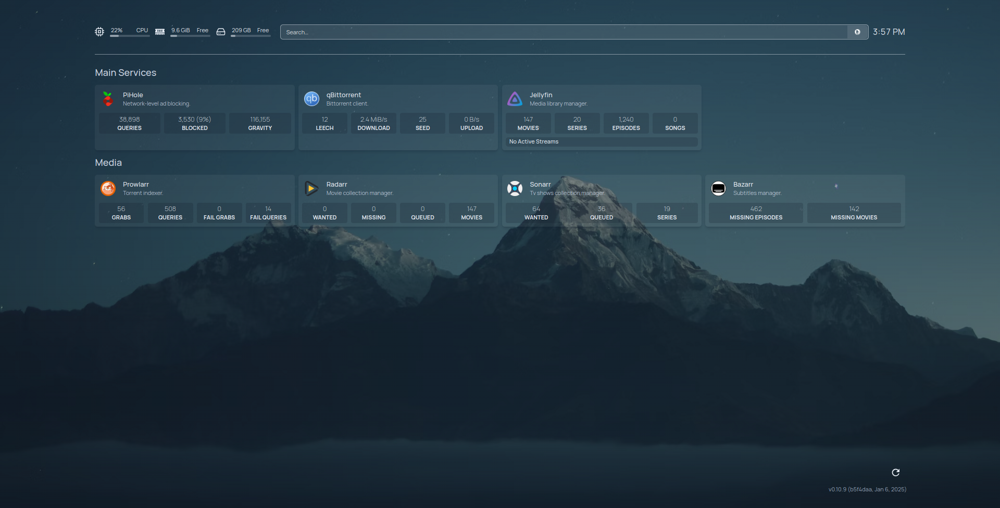

# homelab

Services I run in my homelab.

## Services

- [x] [Homepage](./homepage)
- [x] [Pihole](./pihole)
- [x] [qBittorrent](./qbittorrent)
- [x] [jDownloader2](./jdownloader2)
- [x] [Nginx](./nginx)
- [x] [Sonarr](./sonarr)
- [x] [Radarr](./radarr)
- [x] [Bazarr](./bazarr)
- [x] [Prowlarr](./prowlarr)
- [x] [Jellyfin](./jellyfin)
- [x] [goDashboard](./go-dashboard)

## Environment Variables

| Variable      | Description                       |
|---------------|-----------------------------------|
| `WAREZ_ROOT`  | Root directory for Warez stuff.   |
| `DATA_ROOT`   | Root directory for personal data. |
| `SMB_USERNAME`| Username for SMB shares.          |
| `SMB_PASSWORD`| Password for SMB shares.          |
